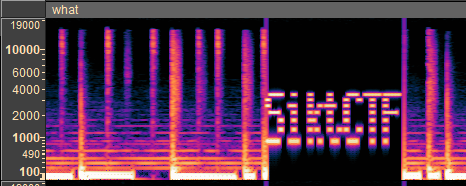
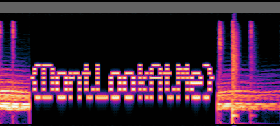

# Writeup
Description:
*Ness is fighting the Sanctuary Guardian, you must help him!*

Listening to the audiofile we can hear some weird interruptions in the music that are very specific.
Using Audacity or similar software to view the spectrogram of the audio track we can se that these noises form text in the spectrogram.

These two parts form the flag **SiktCTF{DontLookAtMe}**