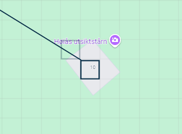

# Writeup

Looking at the image we can quickly understand that this challenge is not about finding this specific location since it is extremely flat and lacks information. 
Naturally we need to look at the exif data for the image. Using tools such as [aperisolve](https://www.aperisolve.com/) or exiftool we get one weird string hidden in Sub-location value: *repeat.anguished.frosted*.
This shouldn't make any sense to a normal person, but some of you may have seen a little website called [what3words](https://what3words.com/) before.
The website has a map of the world divided into 3 metre squares and has given each of the squares an unique combination of three words.
We can use the three words we found with exiftool to get to this location on the map:

This isn't the exact location of the image, since it is talking about a cottage and not a lookout tower. If we look a little to the south we can see the actual location the image is taken, **Høiåshytta**
The flag is either the full name of the cottage or just the name of the place itself: **høiås**